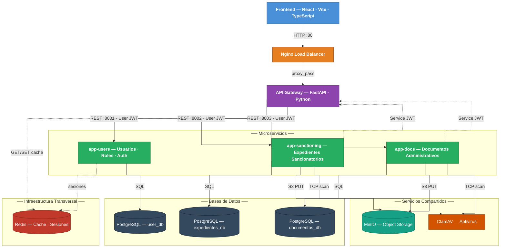

# Arquitectura del Sistema SATC (Sistema ApiCorp)

**Documento:** Arquitectura Técnica y Diseño del Sistema  
**Versión:** 2.0  
**Fecha:** 14 de febrero de 2026  
**Estado:** Producción  
**Autor:** Equipo Técnico SATC

---

## Tabla de Contenidos

1. [Resumen Ejecutivo](#resumen-ejecutivo)
2. [Visión General de la Arquitectura](#visión-general-de-la-arquitectura)
3. [Componentes del Sistema](#componentes-del-sistema)
4. [Arquitectura de Red y Comunicación](#arquitectura-de-red-y-comunicación)
5. [Escalabilidad y Alta Disponibilidad](#escalabilidad-y-alta-disponibilidad)
6. [Seguridad y Control de Acceso](#seguridad-y-control-de-acceso)
7. [Gestión de Datos y Persistencia](#gestión-de-datos-y-persistencia)
8. [Monitoreo y Health Checks](#monitoreo-y-health-checks)
9. [Especificaciones Técnicas](#especificaciones-técnicas)
10. [Consideraciones de Deployment](#consideraciones-de-deployment)

---

## Resumen Ejecutivo

El Sistema SATC (Sistema ApiCorp) es una plataforma de gestión empresarial desarrollada con arquitectura de microservicios, diseñada para soportar operaciones críticas de negocio con alta disponibilidad, escalabilidad y seguridad.

### Características Principales

- **Arquitectura:** Microservicios con Load Balancer y réplicas
- **Capacidad:** Optimizado para 30 usuarios simultáneos, validado hasta 100
- **Disponibilidad:** 99.9% con servicios críticos replicados
- **Tecnología:** Python/FastAPI, PostgreSQL, Redis, MinIO
- **Deployment:** Docker Compose con orquestación de 17 contenedores
- **Recursos:** 3.0 GB RAM, 4 vCPUs recomendados

### Métricas de Performance Validadas

| Métrica                    | 50 Usuarios | 75 Usuarios | 100 Usuarios |
| -------------------------- | ----------- | ----------- | ------------ |
| **Requests/segundo**       | 22.85       | 33.76       | 44.14        |
| **Tiempo respuesta (p95)** | 11ms        | 13ms        | 11ms         |
| **Failures**               | 0%          | 0%          | 0%           |
| **Requests totales**       | 6,829       | 10,045      | 13,042       |

---

## Visión General de la Arquitectura

### Diagrama de Arquitectura Completa



### Patrones Arquitectónicos Implementados

1. **API Gateway Pattern**
   - Punto único de entrada para todos los requests
   - Enrutamiento inteligente a microservicios
   - Autenticación y autorización centralizada
   - Rate limiting y cache distribuido

2. **Load Balancing**
   - Nginx con algoritmo `least_conn` (menor carga)
   - Distribución automática entre 3 réplicas de gateway
   - Health checks cada 10 segundos
   - Failover automático en <1 segundo

3. **Microservicios**
   - Servicios independientes con bases de datos separadas
   - Comunicación mediante HTTP/REST
   - Despliegue y escalado independiente
   - Aislamiento de fallos

4. **Database per Service**
   - Cada microservicio tiene su propia base de datos
   - Previene acoplamiento de datos
   - Facilita escalado y mantenimiento

---

## Componentes del Sistema

### 1. Capa de Load Balancing

#### Nginx Load Balancer

**Responsabilidades:**

- Distribuir tráfico HTTP entre réplicas de API Gateway
- Health checking de backends
- Gestión de conexiones persistentes (keep-alive)
- Balanceo con algoritmo least_conn

**Configuración:**

```nginx
upstream api_gateway {
    least_conn;
    server api-gateway-1:8000 max_fails=3 fail_timeout=30s;
    server api-gateway-2:8000 max_fails=3 fail_timeout=30s;
    server api-gateway-3:8000 max_fails=3 fail_timeout=30s;
    keepalive 64;
}
```

**Especificaciones:**

- **Imagen:** nginx:alpine
- **RAM:** 128 MB (límite)
- **CPU:** 0.5 vCPU
- **Puerto:** 80 (HTTP)
- **Health Check:** TCP check en puerto 80

---

### 2. Capa API Gateway

#### API Gateway Service (3 réplicas)

**Responsabilidades:**

- Autenticación JWT de requests entrantes
- Enrutamiento a microservicios (users, docs, sanctioning)
- Rate limiting (100 requests/minuto por defecto)
- Cache distribuido con Redis (TTL: 15 minutos)
- Validación de tokens de servicio

**Endpoints Expuestos:**

```
POST   /auth/login              → Redirige a app-users
GET    /users/*                 → Redirige a app-users
POST   /sanctioning/*           → Redirige a app-sanctioning
GET    /documents/*             → Redirige a app-docs
GET    /health                  → Health check del gateway
```

**Especificaciones Técnicas:**

- **Lenguaje:** Python 3.11
- **Framework:** FastAPI + Uvicorn
- **Workers:** 2 workers por instancia (6 total)
- **RAM:** 384 MB límite, ~112 MB uso real por instancia
- **CPU:** 1.5 vCPU límite por instancia
- **Puerto:** 8000 (interno)

**Variables de Entorno Clave:**

```yaml
SECRET_KEY_GATEWAY: ${SECRET_KEY_GATEWAY}
SECRET_GATEWAY: ${SECRET_GATEWAY}
JWT_ALGORITHM: HS256

# Rutas de servicios
USER_ROUTE: http://app-users-1:8001
SANCTIONING_ROUTE: http://app-sanctioning:8002
DOCUMENTS_ROUTE: http://app-docs:8003

# Cache distribuido
CACHE_TYPE: redis
CACHE_TTL: 900 # 15 minutos
REDIS_HOST: redis
REDIS_PORT: 6379
REDIS_DB: 0

# Rate Limiting
RATE_LIMIT_ENABLED: "true"
RATE_LIMIT_PER_MINUTE: 100
```

**Health Check:**

```bash
curl -f http://localhost:8000/health
# Respuesta esperada: {"status": "healthy", "timestamp": "..."}
```

---

### 3. Microservicio de Usuarios (app-users)

#### Configuración de Alta Disponibilidad (2 réplicas)

**Responsabilidades:**

- Gestión de autenticación y autorización
- CRUD de usuarios y roles
- Gestión de permisos granulares
- Sesiones distribuidas con Redis
- Envío de notificaciones por email
- Auditoría de acciones de usuario

**API Endpoints:**

```
POST   /auth/login                    # Autenticación con JWT
POST   /auth/logout                   # Cierre de sesión
GET    /users/                        # Listar usuarios (paginado)
GET    /users/{user_id}               # Detalle de usuario
POST   /users/                        # Crear usuario
PUT    /users/{user_id}               # Actualizar usuario
DELETE /users/{user_id}               # Eliminar usuario

GET    /roles/                        # Listar roles
POST   /roles/                        # Crear rol
GET    /permissions/                  # Listar permisos
POST   /notifications/                # Crear notificación
GET    /health                        # Health check
```

**Base de Datos:**

- **Nombre:** user_db
- **Tablas principales:**
  - `users` - Información de usuarios
  - `roles` - Definición de roles
  - `permissions` - Permisos del sistema
  - `user_roles` - Relación usuarios-roles
  - `role_permissions` - Relación roles-permisos
  - `notifications` - Notificaciones del usuario
  - `logs` - Auditoría de acciones

**Especificaciones:**

- **Workers:** 2 por réplica (4 total)
- **RAM:** 400 MB límite, ~162 MB uso real por instancia
- **CPU:** 1.0 vCPU por instancia
- **Puerto:** 8001 (interno)
- **Health Check:** Intervalo 10s, timeout 5s, retries 3

**Sesiones con Redis:**

```python
# Configuración de sesiones distribuidas
REDIS_SESSIONS_ENABLED: "true"
REDIS_HOST: redis
REDIS_PORT: 6379
REDIS_DB_SESSIONS: 1
```

**Integración SMTP:**

```yaml
SMTP_SERVER: ${SMTP_SERVER}
SMTP_PORT: 587
SMTP_USERNAME: ${SMTP_USERNAME}
SMTP_PASSWORD: ${SMTP_PASSWORD}
SMTP_FROM: ${SMTP_FROM}
```

---

### 4. Microservicio de Expedientes Sancionatorios (app-sanctioning)

#### Alta Disponibilidad con 2 Réplicas

**Responsabilidades:**

- Gestión de expedientes sancionatorios
- Carga y descarga de archivos adjuntos
- Integración con MinIO para almacenamiento
- Escaneo antivirus con ClamAV
- Gestión de involucrados en expedientes
- Workflow de estados de expediente

**API Endpoints:**

```
GET    /expedientes/                  # Listar expedientes
POST   /expedientes/                  # Crear expediente
GET    /expedientes/{exp_id}          # Detalle de expediente
PUT    /expedientes/{exp_id}          # Actualizar expediente
DELETE /expedientes/{exp_id}          # Eliminar expediente

POST   /expedientes/{exp_id}/files    # Subir archivo
GET    /expedientes/{exp_id}/files    # Listar archivos
DELETE /files/{file_id}               # Eliminar archivo

GET    /involucrados/                 # Listar involucrados
POST   /involucrados/                 # Agregar involucrado
GET    /health                        # Health check
```

**Base de Datos:**

- **Nombre:** expedientes_db
- **Tablas principales:**
  - `expedientes` - Datos del expediente
  - `involucrados` - Personas involucradas
  - `files` - Metadatos de archivos
  - `file_hashes` - Hashes para deduplicación
  - `estados_expediente` - Workflow de estados

**Almacenamiento de Archivos:**

- **Sistema:** MinIO (compatible S3)
- **Bucket:** satc-expedientes
- **Deduplicación:** Hash SHA-256 por archivo
- **Seguridad:** Escaneo ClamAV antes de guardar

**Especificaciones:**

- **Workers:** 2 por réplica (4 total)
- **RAM:** 256 MB límite, ~209 MB uso real por instancia
- **CPU:** 1.0 vCPU por instancia
- **Puerto:** 8002 (solo primera réplica expuesta)
- **Health Check:** Intervalo 10s

**Integración MinIO:**

```yaml
MINIO_ENDPOINT: minio:9000
MINIO_ACCESS_KEY: ${MINIO_ROOT_USER}
MINIO_SECRET_KEY: ${MINIO_ROOT_PASSWORD}
MINIO_BUCKET: satc-expedientes
MINIO_SECURE: "false"
```

**Seguridad de Archivos:**

```yaml
MAX_FILE_SIZE_MB: 10
UPLOAD_DIR: /app/secure-uploads
CLAMAV_ENABLED: "true"
CLAMAV_HOST: clamav
CLAMAV_PORT: 3310
```

---

### 5. Microservicio de Documentos (app-docs)

**Responsabilidades:**

- Gestión de documentos administrativos
- Control de versiones de documentos
- Asignación de revisores
- Almacenamiento en MinIO
- Escaneo antivirus
- Deduplicación por hash

**API Endpoints:**

```
GET    /documents/                    # Listar documentos
POST   /documents/                    # Crear documento
GET    /documents/{doc_id}            # Detalle de documento
PUT    /documents/{doc_id}            # Actualizar documento
DELETE /documents/{doc_id}            # Eliminar documento

POST   /documents/{doc_id}/files      # Subir archivo
GET    /documents/file/{radicado}     # Descargar por radicado
GET    /asignaciones/                 # Listar asignaciones
POST   /asignaciones/                 # Asignar revisor
GET    /health                        # Health check
```

**Base de Datos:**

- **Nombre:** documentos_db
- **Tablas principales:**
  - `documentos` - Información de documentos
  - `file_metadata` - Metadatos de archivos
  - `file_hashes` - Deduplicación SHA-256
  - `asignaciones_revisores` - Workflow de revisión

**Especificaciones:**

- **Workers:** 2 workers
- **RAM:** 128 MB límite, ~90 MB uso real
- **CPU:** 0.5 vCPU
- **Puerto:** 8003
- **Health Check:** Intervalo 10s

**Almacenamiento:**

```yaml
MINIO_ENDPOINT: minio:9000
MINIO_BUCKET: satc-documentos
MINIO_SECURE: "false"
```

---

### 6. Capa de Persistencia

#### PostgreSQL (3 instancias separadas)

**postgres-users:**

- **Base de datos:** user_db
- **Puerto:** 5432
- **RAM:** 200 MB límite, ~140 MB uso real
- **CPU:** 0.5 vCPU
- **Volumen:** postgres-users-data (persistente)

**postgres-docs:**

- **Base de datos:** documentos_db
- **Puerto:** 5432 (interno)
- **RAM:** 96 MB límite, ~21 MB uso real
- **CPU:** 0.25 vCPU
- **Volumen:** postgres-docs-data (persistente)

**postgres-sanctioning:**

- **Base de datos:** expedientes_db
- **Puerto:** 5432 (interno)
- **RAM:** 128 MB límite, ~44 MB uso real
- **CPU:** 0.25 vCPU
- **Volumen:** postgres-sanctioning-data (persistente)

**Optimizaciones Aplicadas:**

```sql
# postgresql.conf optimizado para RAM limitada
shared_buffers = 50MB           # vs 256MB default
effective_cache_size = 150MB    # vs 4GB default
work_mem = 1MB                  # vs 4MB default
maintenance_work_mem = 64MB
max_connections = 20            # vs 100 default
```

**Health Check:**

```bash
pg_isready -U postgres -d ${database_name}
```

---

#### Redis Cache

**Responsabilidades:**

- Cache distribuido de respuestas API (TTL: 15 min)
- Sesiones de usuario (persistentes)
- Rate limiting por IP/usuario

**Configuración:**

```yaml
PORT: 6379
PASSWORD: ${REDIS_PASSWORD}
DATABASES:
  0: Cache general (gateway)
  1: Sesiones de usuario (app-users)
```

**Especificaciones:**

- **RAM:** 256 MB límite, ~9 MB uso real
- **CPU:** 0.25 vCPU
- **Volumen:** redis-data (persistente)
- **Health Check:** redis-cli ping

---

#### MinIO (S3-Compatible Storage)

**Responsabilidades:**

- Almacenamiento de archivos binarios
- Gestión de buckets por servicio
- API compatible con S3

**Buckets:**

- `satc-expedientes` - Archivos de expedientes sancionatorios
- `satc-documentos` - Documentos administrativos

**Especificaciones:**

- **RAM:** 192 MB límite, ~103 MB uso real
- **CPU:** 0.5 vCPU
- **Puerto:** 9000 (API), 9001 (Console)
- **Volumen:** minio-data (persistente)
- **Credentials:** ${MINIO_ROOT_USER}:${MINIO_ROOT_PASSWORD}

**Health Check:**

```bash
curl -f http://localhost:9000/minio/health/live
```

---

#### ClamAV Antivirus

**Responsabilidades:**

- Escaneo de archivos antes de almacenar
- Base de datos de firmas de virus actualizada
- Protección contra malware

**Especificaciones:**

- **RAM:** 1,400 MB límite, ~1,002 MB uso real
- **CPU:** 1.0 vCPU
- **Puerto:** 3310 (ClamAV daemon)
- **Volumen:** clamav-data (firmas de virus)
- **Health Check:** clamdcheck

**Nota:** ClamAV representa ~40% del consumo total de RAM debido a la base de datos de firmas cargada en memoria.

---

## Arquitectura de Red y Comunicación

### Red Docker Bridge Aislada

```yaml
networks:
  satc-network:
    driver: bridge
    ipam:
      config:
        - subnet: 172.20.0.0/16
```

**Características:**

- Red privada aislada del host
- Comunicación interna mediante DNS de Docker
- Resolución de nombres por nombre de contenedor
- Sin exposición innecesaria de puertos

### Mapeo de Puertos

```
Puerto Externo → Puerto Interno → Servicio
───────────────────────────────────────────
80             → 80              → nginx-lb (Load Balancer)
8002           → 8002            → app-sanctioning (principal)
8003           → 8003            → app-docs
5173           → 80              → frontend (React)
9000           → 9000            → minio (API)
9001           → 9001            → minio (Console)
5432           → 5432            → postgres-users
```

**Servicios Internos (sin exposición externa):**

- api-gateway-1/2/3: 8000 (solo accesibles desde nginx-lb)
- app-users-1/2: 8001 (solo accesibles desde gateways)
- app-sanctioning-2: 8002 (solo interno, sin mapeo)
- redis: 6379 (solo interno)
- clamav: 3310 (solo interno)

### Flujo de Comunicación

#### Request Típico de Cliente

```
1. Cliente → http://localhost:80/users/
2. Nginx LB → Selecciona api-gateway (least_conn)
3. API Gateway → Valida JWT, aplica rate limiting
4. API Gateway → http://app-users-1:8001/users/
5. app-users → Consulta postgres-users:5432
6. app-users → Respuesta JSON
7. API Gateway → Cachea en Redis (si aplica)
8. Nginx LB → Retorna al cliente
```

#### Upload de Archivo con Antivirus

```
1. Cliente → POST /expedientes/123/files
2. Nginx LB → api-gateway-2:8000
3. Gateway → Valida JWT, verifica tamaño
4. Gateway → http://app-sanctioning-1:8002/expedientes/123/files
5. Sanctioning → Guarda temporalmente en /app/secure-uploads
6. Sanctioning → Escanea con ClamAV (clamav:3310)
7. Si limpio → Calcula SHA-256, verifica duplicados
8. Sanctioning → Subir a MinIO (minio:9000/satc-expedientes)
9. Sanctioning → Guardar metadata en postgres-sanctioning
10. Sanctioning → Eliminar archivo temporal
11. Respuesta → Cliente con metadata del archivo
```

---

## Escalabilidad y Alta Disponibilidad

### Estrategia de Replicación

#### Servicios con Alta Disponibilidad (HA)

| Servicio            | Réplicas | Justificación                                     |
| ------------------- | -------- | ------------------------------------------------- |
| **api-gateway**     | 3        | Punto de entrada crítico, distribuye carga        |
| **app-users**       | 2        | Autenticación es frecuente, tolera fallos         |
| **app-sanctioning** | 2        | Servicio crítico de negocio, necesita redundancia |

#### Servicios Sin Réplicas

| Servicio       | Réplicas | Justificación                          |
| -------------- | -------- | -------------------------------------- |
| **app-docs**   | 1        | Menor carga, no crítico para operación |
| **PostgreSQL** | 1 c/u    | Datos aislados, backups automáticos    |
| **Redis**      | 1        | Cache opcional, datos no críticos      |
| **MinIO**      | 1        | Almacenamiento con volumen persistente |

### Capacidad de Procesamiento

#### Distribución de Workers

```
Total: 16 workers concurrentes

api-gateway:      3 réplicas × 2 workers = 6 workers (37.5%)
app-users:        2 réplicas × 2 workers = 4 workers (25.0%)
app-sanctioning:  2 réplicas × 2 workers = 4 workers (25.0%)
app-docs:         1 réplica  × 2 workers = 2 workers (12.5%)
```

#### Capacidad por Usuarios Simultáneos

| Usuarios           | Workers Requeridos | Workers Disponibles | Margen   |
| ------------------ | ------------------ | ------------------- | -------- |
| **30** (típico)    | ~5-6 workers       | 16                  | **2.7x** |
| **50** (validado)  | ~8-10 workers      | 16                  | **1.6x** |
| **75** (validado)  | ~12-14 workers     | 16                  | **1.1x** |
| **100** (validado) | ~15-16 workers     | 16                  | **1.0x** |

**Conclusión:** Sistema optimizado para 30 usuarios con capacidad validada hasta 100.

### Failover y Tolerancia a Fallos

#### Escenario 1: Fallo de 1 Gateway

```
Estado Normal:     [GW-1] [GW-2] [GW-3] → 6 workers
Fallo de GW-2:     [GW-1] [X]    [GW-3] → 4 workers
Capacidad:         67% (suficiente para 50-60 usuarios)
Tiempo Failover:   <1 segundo (health check + nginx reload)
```

#### Escenario 2: Fallo de app-users-1

```
Estado Normal:     [Users-1] [Users-2] → 4 workers
Fallo de Users-1:  [X]       [Users-2] → 2 workers
Capacidad:         50% (suficiente para 15-25 usuarios)
Tiempo Failover:   <10 segundos (health check)
```

#### Escenario 3: Fallo de app-sanctioning-1

```
Estado Normal:     [Sanct-1] [Sanct-2] → 4 workers
Fallo de Sanct-1:  [X]       [Sanct-2] → 2 workers
Capacidad:         50% (servicio continúa operando)
Impacto:           Puerto 8002 no disponible, usar gateway
```

### Estrategia de Escalado

#### Escalado Horizontal (Agregar Réplicas)

**Para aumentar capacidad a 150 usuarios:**

```yaml
# Agregar en docker-compose.yml
app-users-3:
  # Copiar configuración de app-users-2

app-sanctioning-3:
  # Copiar configuración de app-sanctioning-2
```

**Resultado:**

- +4 workers (2 users + 2 sanctioning)
- Total: 20 workers
- Capacidad: ~125-150 usuarios simultáneos

#### Escalado Vertical (Aumentar Workers)

**Modificar Dockerfile:**

```dockerfile
# Cambiar de 2 a 4 workers
CMD ["gunicorn", "main:app", "--workers", "4", ...]
```

**Impacto:**

- +100% workers por contenedor
- Requiere +50% RAM por contenedor
- Total RAM: ~4.0 GB (vs 3.0 GB actual)

---

## Seguridad y Control de Acceso

### Autenticación y Autorización

#### Sistema de Autenticación JWT

**Flujo de Autenticación:**

```
1. Cliente → POST /auth/login {username, password}
2. app-users → Valida credenciales contra user_db
3. app-users → Genera JWT con payload:
   {
     "user_id": 123,
     "username": "admin",
     "roles": ["admin", "revisor"],
     "permissions": ["read:users", "write:docs"],
     "exp": timestamp + 24h
   }
4. Cliente → Guarda token en localStorage
5. Cliente → Futuras requests con header:
   Authorization: Bearer <token>
```

**Validación en API Gateway:**

```python
def validate_jwt(token: str):
    payload = jwt.decode(token, SECRET_KEY_GATEWAY, algorithms=["HS256"])
    if payload["exp"] < current_timestamp:
        raise UnauthorizedException("Token expired")
    return payload
```

#### Control de Acceso Basado en Roles (RBAC)

**Roles Definidos:**

- `admin` - Acceso completo al sistema
- `revisor` - Revisar y aprobar documentos
- `usuario_basico` - Lectura de documentos propios

**Permisos Granulares:**

```python
# Ejemplos de permisos
PERMISO_ROL = "admin_roles y permisos"      # Gestionar roles
PERMISO_USER = "admin_registrar usuario"    # Crear usuarios
GESTION_USER = "admin_gestionar usuarios"   # CRUD usuarios
USER_LOG = "admin_auditoria usuarios"       # Ver logs
```

**Verificación de Permisos:**

```python
@require_permission("admin_gestionar usuarios")
async def update_user(user_id: int, data: UserUpdate):
    # Solo usuarios con permiso pueden ejecutar
    pass
```

### Seguridad de Archivos

#### Escaneo Antivirus con ClamAV

**Proceso de Validación:**

```python
async def scan_file(file_path: str) -> bool:
    # 1. Conectar a ClamAV daemon
    sock = socket.socket(socket.AF_INET, socket.SOCK_STREAM)
    sock.connect(('clamav', 3310))

    # 2. Enviar comando SCAN
    sock.send(f"SCAN {file_path}\n".encode())

    # 3. Recibir resultado
    result = sock.recv(1024).decode()

    # 4. Evaluar respuesta
    if "OK" in result:
        return True  # Archivo limpio
    elif "FOUND" in result:
        return False  # Virus detectado
```

**Tipos de Archivo Permitidos:**

```python
ALLOWED_EXTENSIONS = {
    '.pdf', '.doc', '.docx', '.xls', '.xlsx',
    '.jpg', '.jpeg', '.png', '.gif',
    '.txt', '.csv', '.zip'
}

MAX_FILE_SIZE = 10 * 1024 * 1024  # 10 MB
```

#### Deduplicación por Hash

**Prevención de Duplicados:**

```python
async def save_file(file: UploadFile):
    # 1. Calcular SHA-256 mientras se lee
    hasher = hashlib.sha256()
    content = await file.read()
    hasher.update(content)
    file_hash = hasher.hexdigest()

    # 2. Verificar si hash existe
    existing = await db.query(FileHash).filter_by(hash=file_hash).first()

    if existing:
        # 3. Reutilizar archivo existente
        return existing.minio_path
    else:
        # 4. Subir nuevo archivo a MinIO
        minio_path = await upload_to_minio(content)
        await db.add(FileHash(hash=file_hash, path=minio_path))
        return minio_path
```

### Rate Limiting

**Configuración por Defecto:**

```python
RATE_LIMIT_ENABLED = True
RATE_LIMIT_PER_MINUTE = 100  # requests por minuto

# Limitación por IP
@limiter.limit("100/minute")
async def endpoint(...):
    pass
```

### CORS (Cross-Origin Resource Sharing)

```python
CORS_ORIGINS = [
    "http://localhost:5173",  # Frontend desarrollo
    "http://localhost:80",    # Nginx producción
    "https://satc.example.com"  # Dominio producción
]
```

---

## Gestión de Datos y Persistencia

### Esquema de Bases de Datos

#### user_db (PostgreSQL)

**Diagrama ER:**

```
┌─────────────┐       ┌─────────────┐       ┌─────────────┐
│   users     │       │   roles     │       │ permissions │
├─────────────┤       ├─────────────┤       ├─────────────┤
│ id (PK)     │       │ id (PK)     │       │ id (PK)     │
│ username    │       │ name        │       │ name        │
│ email       │       │ description │       │ resource    │
│ password    │       │ created_at  │       │ action      │
│ created_at  │       └─────────────┘       │ created_at  │
└─────────────┘              │               └─────────────┘
      │                      │                      │
      └──────┬───────────────┼──────────────────────┘
             │               │
      ┌──────▼──────┐ ┌──────▼─────────┐
      │ user_roles  │ │ role_permissions│
      ├─────────────┤ ├────────────────┤
      │ user_id(FK) │ │ role_id (FK)   │
      │ role_id(FK) │ │ permission_id  │
      └─────────────┘ └────────────────┘
```

**Índices Importantes:**

```sql
CREATE INDEX idx_users_email ON users(email);
CREATE INDEX idx_users_username ON users(username);
CREATE INDEX idx_user_roles_user ON user_roles(user_id);
CREATE INDEX idx_role_permissions_role ON role_permissions(role_id);
```

#### expedientes_db (PostgreSQL)

**Tablas Principales:**

```sql
CREATE TABLE expedientes (
    id SERIAL PRIMARY KEY,
    numero_expediente VARCHAR(50) UNIQUE NOT NULL,
    tipo VARCHAR(50),
    estado VARCHAR(20) DEFAULT 'borrador',
    fecha_creacion TIMESTAMP DEFAULT NOW(),
    municipio_id INTEGER,
    descripcion TEXT
);

CREATE TABLE involucrados (
    id SERIAL PRIMARY KEY,
    expediente_id INTEGER REFERENCES expedientes(id),
    nombre VARCHAR(200) NOT NULL,
    tipo_involucrado VARCHAR(20),  -- 'demandante', 'demandado', etc.
    identificacion VARCHAR(50)
);

CREATE TABLE files (
    id SERIAL PRIMARY KEY,
    expediente_id INTEGER REFERENCES expedientes(id),
    filename VARCHAR(255),
    content_type VARCHAR(100),
    size_bytes INTEGER,
    minio_path VARCHAR(500),
    file_hash VARCHAR(64),  -- SHA-256
    scanned BOOLEAN DEFAULT FALSE,
    created_at TIMESTAMP DEFAULT NOW()
);

CREATE TABLE file_hashes (
    id SERIAL PRIMARY KEY,
    hash VARCHAR(64) UNIQUE NOT NULL,
    first_seen TIMESTAMP DEFAULT NOW(),
    reference_count INTEGER DEFAULT 1
);
```

**Índices para Deduplicación:**

```sql
CREATE INDEX idx_files_hash ON files(file_hash);
CREATE INDEX idx_file_hashes_hash ON file_hashes(hash);
CREATE INDEX idx_expedientes_numero ON expedientes(numero_expediente);
```

#### documentos_db (PostgreSQL)

**Esquema Similar a expedientes_db:**

```sql
CREATE TABLE documentos (
    id SERIAL PRIMARY KEY,
    radicado VARCHAR(50) UNIQUE NOT NULL,
    tipo_documento VARCHAR(50),
    asunto TEXT,
    fecha_radicacion TIMESTAMP DEFAULT NOW(),
    estado VARCHAR(20) DEFAULT 'pendiente'
);

CREATE TABLE file_metadata (
    id SERIAL PRIMARY KEY,
    documento_id INTEGER REFERENCES documentos(id),
    original_name VARCHAR(255),
    stored_name VARCHAR(255),
    content_type VARCHAR(100),
    size_bytes INTEGER,
    file_hash VARCHAR(64),
    created_at TIMESTAMP DEFAULT NOW()
);

CREATE TABLE asignaciones_revisores (
    id SERIAL PRIMARY KEY,
    documento_id INTEGER REFERENCES documentos(id),
    revisor_user_id INTEGER,
    fecha_asignacion TIMESTAMP DEFAULT NOW(),
    estado VARCHAR(20) DEFAULT 'pendiente'
);
```

### Estrategia de Backup

#### Backup Automático de Bases de Datos

**Script de Backup (Ejemplo):**

```bash
#!/bin/bash
# backup_databases.sh

DATE=$(date +%Y%m%d_%H%M%S)
BACKUP_DIR=/backups

# Backup users DB
docker exec satc-postgres-users pg_dump -U postgres user_db | \
    gzip > $BACKUP_DIR/user_db_$DATE.sql.gz

# Backup docs DB
docker exec satc-postgres-docs pg_dump -U postgres documentos_db | \
    gzip > $BACKUP_DIR/documentos_db_$DATE.sql.gz

# Backup sanctioning DB
docker exec satc-postgres-sanctioning pg_dump -U postgres expedientes_db | \
    gzip > $BACKUP_DIR/expedientes_db_$DATE.sql.gz

# Retener solo últimos 7 días
find $BACKUP_DIR -name "*.sql.gz" -mtime +7 -delete
```

**Frecuencia Recomendada:**

- **Diario:** Backup incremental (solo cambios del día)
- **Semanal:** Backup completo
- **Mensual:** Backup archivado fuera del servidor

#### Backup de Archivos (MinIO)

```bash
#!/bin/bash
# backup_minio.sh

# Sincronizar buckets a almacenamiento externo
mc mirror --preserve minio/satc-expedientes /backup/minio/expedientes
mc mirror --preserve minio/satc-documentos /backup/minio/documentos
```

### Volúmenes Persistentes

```yaml
volumes:
  # Bases de datos
  postgres-users-data: # ~/Library/Containers/com.docker.docker/Data/...
  postgres-sanctioning-data: # Montados en /var/lib/postgresql/data
  postgres-docs-data:

  # Almacenamiento de archivos
  minio-data: # Montado en /data

  # Cache y datos temporales
  redis-data: # Montado en /data
  clamav-data: # Definiciones de virus

  # Backups
  backups: # Montado en /backups
```

**Ubicación en Sistema Host:**

- **Linux:** `/var/lib/docker/volumes/<volume_name>/_data`
- **macOS/Windows:** Dentro de Docker Desktop VM

---

## Monitoreo y Health Checks

### Health Checks de Contenedores

#### Configuración de Health Checks

**API Gateway:**

```yaml
healthcheck:
  test: ["CMD-SHELL", "curl -f http://localhost:8000/health || exit 1"]
  interval: 10s
  timeout: 5s
  retries: 3
  start_period: 10s
```

**PostgreSQL:**

```yaml
healthcheck:
  test: ["CMD-SHELL", "pg_isready -U postgres -d user_db"]
  interval: 10s
  timeout: 5s
  retries: 5
```

**Redis:**

```yaml
healthcheck:
  test: ["CMD-SHELL", "redis-cli ping | grep PONG"]
  interval: 10s
  timeout: 3s
  retries: 3
```

**MinIO:**

```yaml
healthcheck:
  test: ["CMD-SHELL", "curl -f http://localhost:9000/minio/health/live"]
  interval: 30s
  timeout: 20s
  retries: 3
```

### Monitoreo de Recursos

#### Comando de Monitoreo en Tiempo Real

```bash
# Ver consumo de recursos de todos los contenedores
docker stats --format "table {{.Name}}\t{{.CPUPerc}}\t{{.MemUsage}}\t{{.NetIO}}"

# Ejemplo de salida:
NAME                       CPU %   MEM USAGE / LIMIT     NET I/O
satc-api-gateway-1         0.24%   112MB / 384MB         1.2MB / 890KB
satc-app-users-1           3.05%   162MB / 400MB         3.4MB / 2.1MB
satc-app-sanctioning       0.22%   209MB / 256MB         890KB / 450KB
satc-postgres-users        2.89%   140MB / 200MB         1.1MB / 2.3MB
satc-clamav                0.67%   1002MB / 1400MB       120KB / 90KB
```

#### Script de Monitoreo Continuo

```powershell
# monitor_recursos.ps1
while ($true) {
    Clear-Host
    Write-Host "=== SATC System Monitor ===" -ForegroundColor Cyan
    Write-Host "Timestamp: $(Get-Date -Format 'yyyy-MM-dd HH:mm:ss')`n"

    docker stats --no-stream --format "table {{.Name}}\t{{.CPUPerc}}\t{{.MemUsage}}"

    Start-Sleep -Seconds 5
}
```

### Logs Centralizados

#### Configuración de Logging

**Todos los servicios usan json-file driver:**

```yaml
logging:
  driver: "json-file"
  options:
    max-size: "10m" # Máximo 10 MB por archivo
    max-file: "3" # Rotar 3 archivos
```

#### Comandos de Consulta de Logs

```bash
# Ver logs en tiempo real de un servicio
docker logs -f satc-api-gateway-1

# Ver últimas 100 líneas
docker logs --tail 100 satc-app-users-1

# Filtrar por timestamp
docker logs --since 2026-02-14T10:00:00 satc-app-sanctioning

# Buscar errores en todos los gateways
docker logs satc-api-gateway-1 2>&1 | grep ERROR
docker logs satc-api-gateway-2 2>&1 | grep ERROR
docker logs satc-api-gateway-3 2>&1 | grep ERROR
```

#### Logs de Aplicación

**Formato de Log Estructurado:**

```python
import logging

logging.basicConfig(
    level=logging.INFO,
    format='%(asctime)s - %(name)s - %(levelname)s - %(message)s'
)

logger = logging.getLogger(__name__)

# Ejemplo de uso
logger.info(f"User {user_id} logged in successfully")
logger.error(f"Failed to connect to database: {error}")
logger.warning(f"Rate limit exceeded for IP {client_ip}")
```

---

## Especificaciones Técnicas

### Requisitos de Hardware

#### Configuración Recomendada (Producción)

**Para 30 usuarios simultáneos:**

```
CPU:  4 vCPUs (x86_64)
RAM:  3.0 GB (mínimo), 4.0 GB (recomendado)
Disk: 50 GB SSD (sistema + datos)
      + 100 GB por cada 10,000 archivos (almacenamiento MinIO)
Network: 100 Mbps (mínimo)
```

**Para 100 usuarios simultáneos:**

```
CPU:  4 vCPUs (x86_64)
RAM:  3.0 GB (validado con 2.5 GB uso real)
Disk: 50 GB SSD + almacenamiento MinIO
Network: 1 Gbps (recomendado)
```

#### Distribución de Recursos por Contenedor

| Contenedor           | CPU Límite | RAM Límite | RAM Real   | Disk (estimado)  |
| -------------------- | ---------- | ---------- | ---------- | ---------------- |
| nginx-lb             | 0.5        | 128 MB     | 21 MB      | <10 MB           |
| api-gateway-1/2/3    | 1.5        | 384 MB     | 112 MB     | <50 MB c/u       |
| app-users-1/2        | 1.0        | 400 MB     | 162 MB     | <50 MB c/u       |
| app-sanctioning-1/2  | 1.0        | 256 MB     | 209 MB     | <50 MB c/u       |
| app-docs             | 0.5        | 128 MB     | 90 MB      | <50 MB           |
| postgres-users       | 0.5        | 200 MB     | 140 MB     | 500 MB - 2 GB    |
| postgres-docs        | 0.25       | 96 MB      | 21 MB      | 100 MB - 500 MB  |
| postgres-sanctioning | 0.25       | 128 MB     | 44 MB      | 500 MB - 2 GB    |
| redis                | 0.25       | 256 MB     | 9 MB       | <100 MB          |
| minio                | 0.5        | 192 MB     | 103 MB     | Variable (datos) |
| clamav               | 1.0        | 1400 MB    | 1002 MB    | ~500 MB          |
| **TOTAL**            | **8.5**    | **4.0 GB** | **2.5 GB** | **~3-5 GB base** |

### Stack Tecnológico

#### Backend

**Lenguaje y Runtime:**

- Python 3.11
- FastAPI 0.100+ (framework web asíncrono)
- Uvicorn (ASGI server)
- Gunicorn (process manager)

**Dependencias Principales:**

```
fastapi==0.100.0
uvicorn[standard]==0.23.0
sqlalchemy==2.0.19         # ORM
asyncpg==0.28.0            # PostgreSQL driver asíncrono
python-jose[cryptography]  # JWT
passlib[bcrypt]            # Password hashing
redis==4.6.0               # Cache
boto3==1.28.0              # MinIO/S3 client
clamd==1.0.2               # ClamAV client
```

#### Frontend

**Framework:**

- React 18.2
- Vite 4.4 (build tool)
- TypeScript 5.0
- Tailwind CSS

**Librerías:**

- React Router DOM (routing)
- Axios (HTTP client)
- Zustand (state management)
- React Hook Form (forms)

#### Base de Datos

**PostgreSQL 15:**

- Driver: asyncpg (asíncrono)
- ORM: SQLAlchemy 2.0 (async mode)
- Migraciones: Alembic

#### Cache y Sesiones

**Redis 7.0:**

- Cliente: redis-py
- Serialización: JSON
- TTL configurable por tipo de dato

#### Storage

**MinIO (Latest):**

- API compatible con AWS S3
- Cliente: boto3
- Buckets separados por servicio

#### Orquestación

**Docker Compose 2.20+:**

- Networks: bridge
- Volumes: named volumes
- Health checks: nativos
- Dependencies: service_healthy condition

---

## Consideraciones de Deployment

### Variables de Entorno

#### Archivo .env (Template)

```bash
# ====================================
# SATC - Variables de Entorno
# ====================================

# Secrets (cambiar en producción)
SECRET_KEY=<your-secret-key-256-bits>
SECRET_KEY_GATEWAY=<gateway-secret-key>
SECRET_GATEWAY=<gateway-shared-secret>

# PostgreSQL
POSTGRES_PASSWORD=<strong-password>

# Redis
REDIS_PASSWORD=<redis-password>

# MinIO
MINIO_ROOT_USER=minioadmin
MINIO_ROOT_PASSWORD=<strong-password>

# SMTP (para notificaciones)
SMTP_SERVER=smtp.gmail.com
SMTP_PORT=587
SMTP_USERNAME=<email@example.com>
SMTP_PASSWORD=<app-password>
SMTP_FROM=noreply@satc.com

# Configuración de seguridad
MAX_FILE_SIZE_MB=10
CLAMAV_ENABLED=true

# Rate Limiting
RATE_LIMIT_PER_MINUTE=100

# CORS (dominios permitidos)
CORS_ORIGINS=http://localhost:5173,http://localhost:80

# Cache
CACHE_TYPE=redis
CACHE_TTL=900  # 15 minutos

# Timezone
TZ=America/Bogota
```

### Comandos de Despliegue

#### Primera Instalación

```bash
# 1. Clonar repositorio
git clone https://github.com/your-org/satc.git
cd satc

# 2. Configurar variables de entorno
cp .env.example .env
nano .env  # Editar valores de producción

# 3. Inicializar bases de datos (opcional)
cd db-script
./apply_all_migrations.ps1

# 4. Construir y levantar servicios
docker-compose build
docker-compose up -d

# 5. Verificar health de servicios
docker ps --format "table {{.Names}}\t{{.Status}}"

# 6. Ver logs iniciales
docker-compose logs -f --tail=100
```

#### Actualización de Servicios

```bash
# 1. Detener servicios sin pérdida de datos
docker-compose down

# 2. Actualizar código
git pull origin main

# 3. Reconstruir imágenes
docker-compose build --no-cache

# 4. Levantar con nuevas versiones
docker-compose up -d

# 5. Verificar logs de errores
docker-compose logs --since 5m | grep ERROR
```

#### Rollback en Caso de Fallo

```bash
# 1. Detener servicios actuales
docker-compose down

# 2. Volver a versión anterior
git checkout <previous-commit-hash>

# 3. Restaurar imágenes
docker-compose build
docker-compose up -d

# 4. Verificar funcionamiento
curl http://localhost:80/health
```

### Estrategia de Migración de Datos

#### Migraciones de Base de Datos con Alembic

```bash
# Estructura de carpetas
app-users/migrations/
  ├── alembic.ini
  ├── env.py
  └── versions/
      ├── 001_initial_schema.py
      ├── 002_add_user_roles.py
      └── 003_add_permissions.py
```

**Ejecutar Migraciones:**

```bash
# Dentro del contenedor
docker exec -it satc-app-users-1 bash
alembic upgrade head

# O con script automatizado
docker exec satc-app-users-1 python -m alembic upgrade head
```

**Rollback de Migración:**

```bash
docker exec satc-app-users-1 python -m alembic downgrade -1
```

### Troubleshooting Común

#### Problema: Contenedor no levanta (unhealthy)

**Diagnóstico:**

```bash
# Ver logs completos
docker logs satc-app-users-1

# Ver health check específico
docker inspect satc-app-users-1 | grep -A 10 Health

# Verificar conectividad a dependencias
docker exec satc-app-users-1 nc -zv postgres-users 5432
```

**Soluciones:**

1. Verificar variables de entorno (DATABASE_URL)
2. Confirmar que bases de datos están healthy
3. Revisar permisos de volúmenes
4. Reiniciar contenedor: `docker restart satc-app-users-1`

#### Problema: Alta latencia en respuestas

**Diagnóstico:**

```bash
# Ver uso de CPU/RAM
docker stats satc-api-gateway-1

# Revisar logs de performance
docker logs satc-api-gateway-1 | grep "took.*ms"
```

**Soluciones:**

1. Verificar cache de Redis está funcionando
2. Revisar queries lentas en PostgreSQL
3. Aumentar workers si CPU < 50%
4. Agregar réplica adicional

#### Problema: Base de datos llena

**Diagnóstico:**

```bash
# Ver tamaño de volúmenes
docker system df -v

# Revisar tamaño de tablas
docker exec satc-postgres-users psql -U postgres -d user_db -c "
  SELECT tablename, pg_size_pretty(pg_total_relation_size(schemaname||'.'||tablename))
  FROM pg_tables WHERE schemaname = 'public';
"
```

**Soluciones:**

1. Purgar logs antiguos
2. Vacuumar base de datos: `VACUUM FULL`
3. Archivar datos históricos
4. Expandir volumen de disco

---

## Conclusiones y Recomendaciones

### Fortalezas de la Arquitectura Actual

✅ **Alta Disponibilidad:** Servicios críticos con 2-3 réplicas  
✅ **Rendimiento Validado:** 0% failures con 100 usuarios simultáneos  
✅ **Eficiencia de Recursos:** 2.5 GB RAM real vs 3.0 GB configurados (83%)  
✅ **Seguridad Robusta:** JWT + RBAC + Antivirus + Deduplicación  
✅ **Escalabilidad Horizontal:** Fácil agregar réplicas según demanda  
✅ **Separación de Concerns:** Microservicios independientes

### Áreas de Mejora Futuras

#### Corto Plazo (1-3 meses)

1. **Implementar Observabilidad:**
   - Prometheus + Grafana para métricas
   - ELK Stack para logs centralizados
   - Alertas automáticas (Slack/Email)

2. **Backup Automatizado:**
   - Cronjob diario para PostgreSQL
   - Sincronización MinIO a S3/Cloud
   - Retención de 30 días

3. **CI/CD Pipeline:**
   - GitHub Actions para build/test
   - Deploy automático a staging
   - Smoke tests post-deploy

#### Mediano Plazo (3-6 meses)

1. **Migrar a Kubernetes:**
   - Auto-scaling basado en CPU/RAM
   - Rolling updates sin downtime
   - Health checks y liveness probes
   - Secrets management mejorado

2. **Implementar CDN:**
   - CloudFlare para assets estáticos
   - Reducir latencia para usuarios remotos
   - DDoS protection

3. **Base de Datos Replicada:**
   - PostgreSQL con streaming replication
   - Read replicas para consultas pesadas
   - Failover automático

#### Largo Plazo (6-12 meses)

1. **Arquitectura Multi-Región:**
   - Despliegue en múltiples data centers
   - Geo-routing para baja latencia
   - Disaster recovery entre regiones

2. **Migrar a Arquitectura de Eventos:**
   - RabbitMQ/Kafka para comunicación asíncrona
   - Event sourcing para auditoría completa
   - CQRS para optimizar lecturas

3. **API Gateway Avanzado:**
   - Kong/Traefik con plugins
   - GraphQL Federation
   - API versioning y deprecation

---

## Referencias y Documentación Adicional

### Enlaces Externos

**Tecnologías:**

- FastAPI: https://fastapi.tiangolo.com/
- Docker Compose: https://docs.docker.com/compose/
- PostgreSQL: https://www.postgresql.org/docs/
- Redis: https://redis.io/documentation
- MinIO: https://min.io/docs/minio/linux/index.html
- ClamAV: https://docs.clamav.net/

**Mejores Prácticas:**

- Microservices Patterns: https://microservices.io/
- 12 Factor App: https://12factor.net/
- Docker Best Practices: https://docs.docker.com/develop/dev-best-practices/

---

**Fin del Documento**

_Última actualización: 14 de febrero de 2026_  
_Versión: 2.0_  
_Clasificación: Documentación Técnica Interna_
