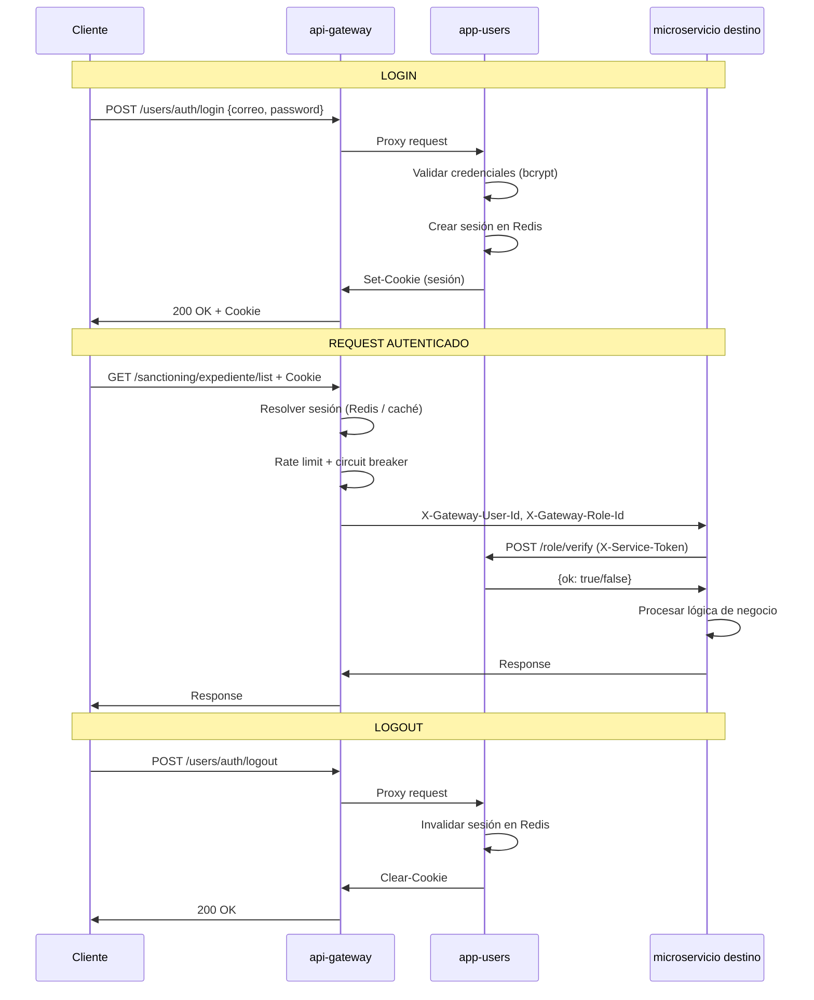

# SATC - Sistema de Administración de Trámites de Corpochivor

> Sistema modular de arquitectura de microservicios para la gestión de expedientes sancionatorios, infracciones ambientales, involucrados, control documental con versionamiento, y administración centralizada de usuarios.

[](https://www.python.org/)
[](https://fastapi.tiangolo.com/)
[](https://react.dev/)
[](https://www.postgresql.org/)
[](https://docs.docker.com/compose/)

---

## 📚 Tabla de Contenidos

### [1. Arquitectura](#1-arquitectura)

- [1.1 Visión General](#11-visión-general)
- [1.2 Microservicios](#12-microservicios)
- [1.3 Comunicación](#13-comunicación-entre-servicios)

### [2. Seguridad](#2-seguridad)

- [2.1 Autenticación y Sesiones](#21-autenticación-y-sesiones)
- [2.2 Flujo de Autenticación](#22-flujo-de-autenticación)
- [2.3 Control de Permisos](#23-control-de-permisos)
- [2.4 Comunicación Servicio-a-Servicio](#24-comunicación-servicio-a-servicio)
- [2.5 Otras Capas de Seguridad](#25-otras-capas-de-seguridad)

### [3. Base de Datos](#3-base-de-datos)

- [3.1 Arquitectura](#31-arquitectura-de-datos)
- [3.2 Modelos Principales por Microservicio](#32-modelos-principales-por-microservicio)

### [4. Implementación](#4-implementación)

- [4.1 Stack Tecnológico](#41-stack-tecnológico)
- [4.2 Despliegue con Docker Compose](#42-despliegue-con-docker-compose)
- [4.3 Variables de Entorno](#43-variables-de-entorno)
- [4.4 Testing](#44-testing)

---

## 1. Arquitectura

### 1.1 Visión General

SATC implementa una arquitectura de microservicios desacoplados que se comunican a través de un API Gateway centralizado, siguiendo el patrón Database-per-Service para aislamiento de datos. Todo el stack corre en contenedores Docker orquestados por Docker Compose, detrás de un proxy Nginx.

#### Diagramas del Sistema

**Componentes y Conectores (CYC)** — flujo desde el navegador, el reverse proxy como único punto de entrada, el API Gateway como nodo central, los 5 microservicios con sus bases de datos propias, y los servicios compartidos (Redis, MinIO, ClamAV, Backup Service):


**Vista por Capas** — Edge (reverse proxy) → Presentación (frontend) → Comunicación (API Gateway) → Lógica (microservicios de dominio) → Datos (PostgreSQL × 5, Redis, MinIO):


**Despliegue** — separación entre red pública (frontend + Nginx) y red privada (microservicios, bases de datos, servicios compartidos) sobre un único nodo:


**Mapeo de Puertos**:


**Principios de Diseño:**

- **Separación de Responsabilidades**: cada microservicio gestiona un dominio de negocio (identidad, expedientes sancionatorios, documentos, involucrados, infracciones).
- **Database per Service**: cada servicio posee su propia base de datos PostgreSQL aislada, sin dependencias cruzadas entre esquemas.
- **API Gateway Pattern**: único punto de entrada público; valida sesión, inyecta contexto (`X-Gateway-*`) y aplica rate limiting antes de reenviar al backend correspondiente.
- **Service-to-Service con identidad verificable**: cada microservicio tiene su propio secreto de firma; el receptor determina quién lo llamó por cuál secreto validó la firma, no por lo que el token dice ser.
- **Comunicación Asíncrona**: `httpx.AsyncClient` con HTTP/2 y connection pooling en gateway y microservicios.
- **Stateless a nivel de proceso**: la sesión vive en Redis, no en memoria de un worker — permite escalar cada servicio horizontalmente (Gunicorn multi-worker) sin pegar sesiones a un proceso.

**Nota de Implementación:**

> Las 5 bases de datos PostgreSQL corren en contenedores independientes en la red privada `satc-private`; solo `nginx-lb` está expuesto al exterior. Cada microservicio solo conoce su propia cadena de conexión y las URLs internas de los servicios con los que colabora.

---

### 1.2 Microservicios

#### app-users (Puerto 8001)

**Dominio:** Identidad, Acceso, RBAC y Comunicaciones

Responsabilidades: autenticación (login/logout, sesiones en Redis), CRUD de usuarios, roles y permisos, notificaciones en sistema, envío de emails, auditoría de acciones, recuperación de contraseñas. Es el único servicio consultado por los demás para verificar permisos (`POST /role/verify`) y resolver identidad de usuarios (`POST /user/batch`).

**Base de datos:** `user_db`

#### app-sancionatoria (Puerto 8002)

**Dominio:** Expedientes Sancionatorios

Gestión de expedientes, involucrados vinculados, actos administrativos (con notificación y comunicación), flujo de etapas procesales (indagación preliminar, medida preventiva, formulación de cargos, decisión de fondo, recursos, cesación, cierre), alertas automáticas por vencimiento, geografía (municipios/veredas).

**Base de datos:** `expedientes_db`

#### app-docs (Puerto 8003)

**Dominio:** Control Documental y Versionamiento

Gestión de documentos corporativos con versionamiento automático, flujo de revisión multi-revisor, deduplicación de archivos por hash (MinIO), escaneo antivirus (ClamAV) antes de aceptar cualquier archivo, endpoint centralizado de hashes de archivo (`/files/*`) consumido por sancionatoria e infraction.

**Base de datos:** `documentos_db`

#### app-involved (Puerto 8004)

**Dominio:** Registro Centralizado de Involucrados

Fuente única de verdad de personas/entidades involucradas en expedientes (por documento de identidad), consumido por sancionatoria e infraction vía `X-Service-Token`. Índice único `(numero_documento, tipo_documento)` evita duplicados incluso bajo altas concurrentes.

**Base de datos:** `involucrados_db`

#### app-infraction (Puerto 8005)

**Dominio:** Infracciones Ambientales

Gestión de infracciones y su ciclo de vida: actos administrativos, etapas (respuesta, informe técnico, concepto, cierre), solicitudes de información, medidas preventivas, reportes. Estructura análoga a app-sancionatoria pero como dominio de negocio independiente.

**Base de datos:** `infracciones_db`

#### api-gateway (Puerto 8000 interno)

**Dominio:** Enrutamiento, Autenticación y Seguridad Perimetral

Responsabilidades:

- Proxy reverso hacia los 5 microservicios, enrutado por prefijo de path.
- Decodificación y validación de la cookie de sesión JWT.
- Inyección de headers de contexto confiables (`X-Gateway-Token`, `X-Gateway-User-Id`, `X-Gateway-Role-Id`) — siempre despojados de cualquier valor que el cliente haya intentado inyectar.
- Rate limiting por IP y por usuario (Redis, ventana fija).
- Circuit breaker por servicio (5 fallos → circuito abierto 30s).
- Caché de tokens decodificados (Redis o local, configurable).
- `PUBLIC_ROUTES` scopeadas por servicio: una ruta pública en un microservicio no expone homónimas en los demás.
- `follow_redirects=False`: ningún backend puede hacer que el gateway repita una petición autenticada contra un destino arbitrario.

---

### 1.3 Comunicación entre Servicios

#### Patrón de Comunicación

```
Cliente → nginx-lb → api-gateway
┌────────────────────────────────┐
│ Cookie: session=<opaco>        │
│ Content-Type: application/json │
└────────────────────────────────┘

api-gateway → Microservicio
┌─────────────────────────────────────────────────────┐
│ X-Gateway-Token: SECRET_GATEWAY                     │
│ X-Gateway-User-Id: 123                              │
│ X-Gateway-Role-Id: 2                                │
│ Content-Type: application/json                      │
└─────────────────────────────────────────────────────┘

Microservicio → Microservicio (directo, red privada)
┌────────────────────────────────────────────────────┐
│ X-Service-Token: <JWT firmado con secreto propio>   │
└────────────────────────────────────────────────────┘
```

#### Mapeo de Rutas (Gateway)

| Prefijo          | Destino           | Puerto interno |
| ----------------- | ------------------ | -------------- |
| `/users/*`        | app-users          | 8001           |
| `/sanctioning/*`  | app-sancionatoria  | 8002           |
| `/documents/*`    | app-docs           | 8003           |
| `/involveds/*`    | app-involved       | 8004           |
| `/infraction/*`   | app-infraction     | 8005           |

**Rutas públicas** (sin sesión, scopeadas por servicio — ver `api-gateway/main.py::PUBLIC_ROUTES`):

- `users`: `auth/login`, `auth/recovery-code`, `auth/recovery`, `auth/logout`, `role/verify`, `user/batch`, `user/permission`, `notification/add`, `email/send`, `email/send-bulk`, `email/send-alert-report`
- `documents`: `files/increment-usage`, `files/decrement-usage`, `files/batch` (protegidas igual por `X-Service-Token` en el destino, no por sesión de usuario)
- `health` es pública en los 5 servicios (healthchecks de Docker)

---

## 2. Seguridad

### 2.1 Autenticación y Sesiones

El login vive en `app-users`. Tras validar credenciales (bcrypt), la sesión se guarda en Redis (no en JWT autocontenido) y se referencia con una cookie httpOnly. Esto permite invalidar sesiones en tiempo real (logout, expiración forzada) sin esperar a que expire un token.

### 2.2 Flujo de Autenticación



### 2.3 Control de Permisos

El modelo es RBAC clásico (Usuario → Rol → Permisos), pero la verificación **no** vive en un JWT autocontenido: cada microservicio que necesita comprobar un permiso llama a `app-users` (`POST /role/verify`) vía `X-Service-Token`, con resultado cacheado en memoria por proceso (TTL corto) para no golpear la red en cada request. Fail-closed: cualquier error de red o respuesta no-200 se trata como "sin permiso", nunca como acceso concedido por defecto.

Las categorías de permiso en el frontend se derivan dinámicamente del prefijo del nombre del permiso (`sancionatorio_*`, `infraction_*`, `documento_*`, etc.) — no hay listas hardcodeadas que haya que sincronizar manualmente al agregar un permiso nuevo.

### 2.4 Comunicación Servicio-a-Servicio

Cada microservicio tiene su **propio secreto** de firma (`SERVICE_SECRET_KEY`), distinto entre sí y distinto del secreto que usa el gateway (`SECRET_GATEWAY`). Un servicio que recibe una llamada este-oeste prueba el token contra el secreto de cada caller que espera (`EXPECTED_CALLERS`); la identidad del llamante la determina **cuál secreto validó la firma**, no el campo `service` que el propio token declara — se exige además que ambos coincidan, así una firma válida con identidad falseada también se rechaza.

Endpoints marcados como *service-only* exigen `X-Service-Token` estricto y rechazan `X-Gateway-Token`, aunque el gateway lo inyecte en toda petición que reenvía.

### 2.5 Otras Capas de Seguridad

- **Rate limiting** (api-gateway): ventana fija en Redis, por IP (`X-Forwarded-For` leído de derecha a izquierda, como lo agrega nginx) y por usuario autenticado. Fail-open si Redis no responde.
- **Antivirus** (app-docs): todo archivo subido pasa por ClamAV antes de guardarse; rechazo fail-closed si el escaneo falla.
- **Deduplicación por hash** (app-docs): evita almacenar el mismo archivo dos veces y centraliza el contador de referencias (`numero_usos`) que decide cuándo el cleanup scheduler puede purgarlo.
- **Cookies**: `Secure` activo por defecto en producción (HTTPS); solo se desactiva explícitamente en desarrollo local sobre HTTP plano.
- **Path-traversal guard** (api-gateway): rechaza segmentos `.`/`..` en el path antes de construir la URL de destino.
- **UNIQUE constraints a nivel de BD** como última línea de defensa contra condiciones de carrera (ej. involucrados duplicados en altas concurrentes), no solo checks a nivel de aplicación.

---

## 3. Base de Datos

### 3.1 Arquitectura de Datos

**Estrategia:** Database per Service. Cinco instancias PostgreSQL 15 independientes, una por microservicio, cada una en su propio contenedor y volumen:

| Base de datos      | Propietario         |
| ------------------- | -------------------- |
| `user_db`            | app-users            |
| `expedientes_db`     | app-sancionatoria    |
| `documentos_db`      | app-docs             |
| `involucrados_db`    | app-involved         |
| `infracciones_db`    | app-infraction       |

Sin foreign keys entre bases de datos distintas: las referencias cruzadas (ej. `usuario_id` en una tabla de auditoría de otro servicio) son IDs sueltos, resueltos vía llamada HTTP cuando se necesita mostrar el nombre/documento del usuario.

### 3.2 Modelos Principales por Microservicio

**user_db**: `usuarios`, `roles`, `permisos`, `roles_permisos`, `notificaciones`, `auditoria`.

**expedientes_db**: `expedientes`, `involucrado_expediente` (relación), etapas como tablas propias (`etapa_indagacion`, `etapa_medida_preventiva`, `etapa_formulacion_cargos`, `etapa_decision_fondo`, `etapa_probatoria_recurso`, `etapa_cesacion`, `etapa_cierre_probatoria`, `etapa_ejecucion_sancion`, `etapa_apertura_probatoria`, `etapa_inicio_sancionatorio`), `acto_administrativo`, `notificacion`, `municipios`/`veredas`, `auditoria`.

**documentos_db**: `documentos`, `versiones_documento`, `revisiones`, `asignaciones_revisores`, `auditoria_documentos`, `file_hash` (deduplicación centralizada).

**involucrados_db**: `involucrado` (con índice UNIQUE `numero_documento, tipo_documento`), `auditoria`.

**infracciones_db**: `expediente` (infracciones), `acto_administrativo`, `comunicacion`, `etapa_respuesta`, `informe_tecnico`, `etapa_acoger_concepto`, `etapa_cierre`, `medida_preventiva`, `solicitud_informacion`, `notificacion`, `quejoso`, `recurso_afectado`, `auditoria`.

---

## 4. Implementación

### 4.1 Stack Tecnológico

#### Capacidad (Gunicorn workers por servicio)

| Servicio | Workers |
| --- | --- |
| api-gateway | 6 |
| app-users | 4 |
| app-sancionatoria | 4 |
| app-involved | 4 |
| app-infraction | 4 |
| app-docs | 1 |

`--preload` activo en todos: el proceso maestro carga la app una vez y los workers heredan la memoria por copy-on-write, en vez de duplicarla por worker.


**Backend:** FastAPI (async), SQLAlchemy 2.0 async, PostgreSQL 15, `python-jose` (JWT), `httpx` (HTTP/2, connection pooling), Gunicorn multi-worker, Redis (sesiones, caché, rate limiting), MinIO (object storage), ClamAV (antivirus).

**Frontend:** React 19 + TypeScript 5.8 + Vite 7, TailwindCSS + DaisyUI, React Router DOM 7.7, Storybook para desarrollo aislado de componentes.

**Infraestructura:** Docker Compose, Nginx como proxy/load balancer, backups automáticos programados (Postgres + MinIO).

### 4.2 Despliegue con Docker Compose

El único método soportado de despliegue es Docker Compose — no hay instrucciones de instalación manual de PostgreSQL/MinIO/ClamAV en el host; todo corre en contenedores.

```bash
git clone <repo-url>
cd SATC

# Completar .env en la raíz (ver sección 5.3)

docker compose build
docker compose up -d
```

Servicios accesibles tras el arranque (esperar a que todos los healthchecks pasen):

- Aplicación completa: `http://localhost:8000` (vía `nginx-lb`)
- Swagger de cada microservicio: disponible internamente en su puerto (no expuesto al host por defecto; usar `docker compose exec` o exponer temporalmente para depurar)

Para cambios de solo código en desarrollo, sincronizar con `docker cp` + `docker restart` es más rápido que rebuild; para cambios de dependencias o variables de entorno, `docker compose up -d --no-deps <service>` o rebuild completo. Ver `REFACTOR_PLAYBOOK.md` para el detalle del flujo usado durante el desarrollo.

### 4.3 Variables de Entorno

Archivo `.env` único en la raíz del repo (gitignored), consumido por `docker-compose.yml`. Claves relevantes:

```env
# Postgres
POSTGRES_PASSWORD=

# Redis
REDIS_PASSWORD=

# MinIO
MINIO_ROOT_USER=
MINIO_ROOT_PASSWORD=

# JWT / Gateway
SECRET_KEY=
SECRET_KEY_GATEWAY=
SECRET_GATEWAY=

# Secreto propio de cada microservicio (identidad este-oeste)
USERS_SERVICE_SECRET=
SANCTIONING_SERVICE_SECRET=
DOCS_SERVICE_SECRET=
INVOLVED_SERVICE_SECRET=
INFRACTION_SERVICE_SECRET=

# CORS
CORS_ORIGINS=

# Email (Google OAuth para SMTP)
GOOGLE_CLIENT_ID=
GOOGLE_CLIENT_SECRET=
GOOGLE_REFRESH_TOKEN=
SMTP_FROM=

# Antivirus / uploads
CLAMAV_ENABLED=true
MAX_FILE_SIZE_MB=10

# Rate limiting / caché (gateway)
RATE_LIMIT_ENABLED=true
RATE_LIMIT_PER_MINUTE=100
CACHE_TYPE=redis
CACHE_TTL=
```

Generar secretos:

```bash
python -c "import secrets; print(secrets.token_urlsafe(32))"
```

> **Producción:** estos secretos deben ser distintos a los usados en desarrollo, `COOKIE_SECURE` no debe sobreescribirse a `"false"` (el default seguro queda vigente), y `CORS_ORIGINS` debe apuntar al dominio real, no a `localhost`.

### 4.4 Testing

Cada microservicio (incluido api-gateway) trae su propia suite `pytest` + `pytest-asyncio` en `tests/`, contra una base de datos Postgres de pruebas dedicada (aislamiento por `TRUNCATE`, no por rollback). Los tokens de servicio en los fixtures se firman con el secreto real del caller esperado, igual que en producción.

```bash
docker compose exec app-users pytest
docker compose exec app-docs pytest
docker compose exec app-sancionatoria pytest
docker compose exec app-involved pytest
docker compose exec app-infraction pytest
docker compose exec api-gateway pytest
```

Frontend:

```bash
cd frontend
npx tsc --noEmit
npx eslint src
```

---

## 📚 Documentación Adicional

- **`REFACTOR_PLAYBOOK.md`**: playbook reusable de refactor aplicado a cada microservicio.
- **`documentacion/`**: manuales versionados de arquitectura, seguridad y manual de usuario.

---

**Mantenedor:** Julian David Rodriguez Fernandez
